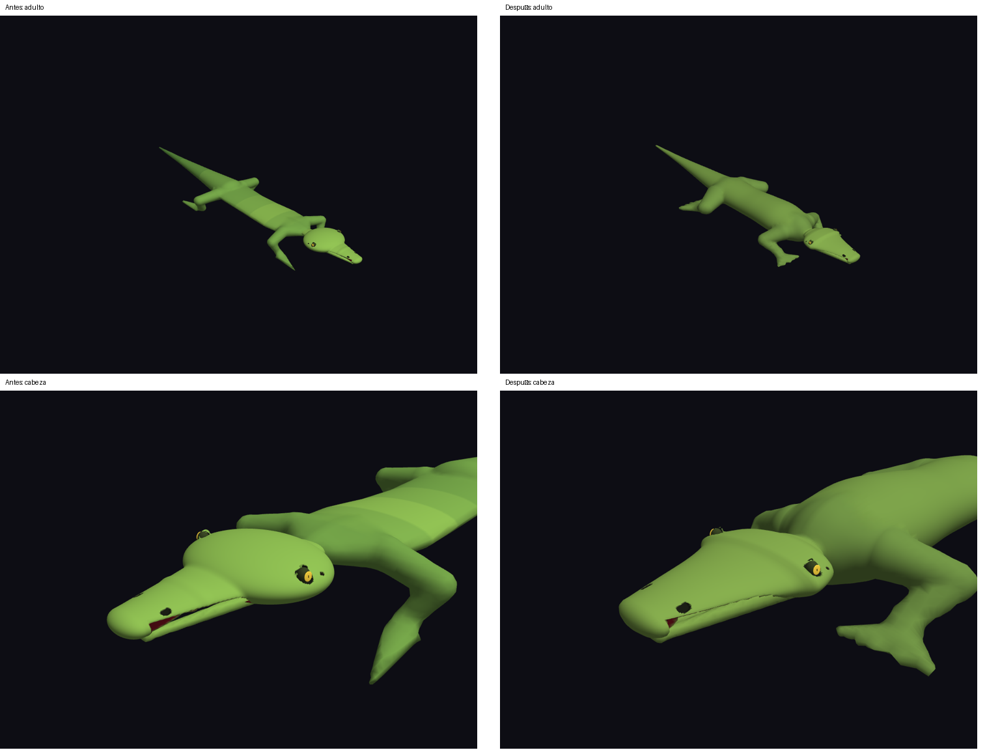

# Lagarto: anatomía, detalle local y crecimiento

## Estado y referencia

Implementación sobre el árbol de trabajo recibido, basado en `4453204` y con
cambios locales previos en cabeza, AnatomyGraph, Lizard y render. Se conservaron
esos cambios. «Antes» designa ese árbol inicial, no una reconstrucción del commit.
La referencia se compiló y todas sus pruebas pasaron antes de editar el motor.
Se ejecutaron ambos demos y se capturaron las cinco edades. Para comparar las
formas sin confundirlas con cambios de cámara se recompiló después una copia
congelada de esa referencia con las mismas ocho cámaras de validación; sólo se
modificó el control de captura de esa copia.

## Causas comprobadas

- **Cuerpo:** el grafo previo ya explicitaba conexiones, pero cada conexión seguía
  creando una cápsula independiente. Los cambios lineales de radio y sus tapas
  marcaban las estaciones. Además, altura torácica y `bodyFlattening` se
  multiplicaban, produciendo un tronco excesivamente plano. Los dedos anteriores
  convergían casi sobre la misma línea y parecían puntas.
- **Cabeza:** el elipsoide craneal dominaba un rostro mucho menos profundo. La
  transición entre ambas masas seguía siendo visible pese al loft facial previo.
- **Detalle:** la rejilla uniforme y el límite por eje desperdiciaban muestras en
  la cola y espacios vacíos. La cabeza local previa mejoraba las narinas, pero
  necesitaba hasta 2,2 millones de celdas y usaba una segunda superficie cervical.
  La estadística anterior podía informar el voxel solicitado aunque el límite
  por eje hubiera cambiado su tamaño real.
- **Agujeros adicionales:** el umbral absoluto de área eliminaba triángulos
  pequeños válidos. Cuando varias aristas llegaban al mismo nodo de rejilla,
  generaban vértices coincidentes distintos; descartar sus triángulos degenerados
  dejaba fronteras abiertas. Ambos casos tenían que corregirse por separado.
- **Crecimiento:** cabeza/anfitrión heredado y grafo corporal seguían rutas de
  interpolación distintas. Esto dejaba dos autoridades geométricas. La cámara
  también orbitaba y se reajustaba al tamaño solicitado, ocultando la alometría.
- **Asincronía:** faltaba reconocer el fingerprint en ejecución y podían encolarse
  copias del mismo trabajo. Las métricas describían el resultado recién generado,
  no necesariamente el mostrado. Una animación más rápida que el mesher mostraba
  saltos grandes entre snapshots completos.

## Representación corporal y cefálica

`LizardPhenotype -> AnatomyGraph -> SDFSweepStation[] -> MonsterSDF` conserva la
semántica y las identidades existentes. El compilador obtiene un único barrido
axial desde cuello hasta extremo caudal. Las secciones elípticas interpolan radio
lateral, vertical y centro mediante Hermite con tangentes que preservan monotonía.
Sólo los extremos del barrido tienen tapas. Ya no se unen las cápsulas axiales
para formar la piel final del lagarto.

Se aumentó la profundidad torácica/abdominal, se levantó suavemente el perfil
central y se separó la base caudal de la estación pélvica antes coincidente.
Los miembros mantienen raíces simétricas, muslo/húmero más fuertes y cambios de
dirección en rodilla/codo; los dedos se abren en abanico con grosor suficiente
para la representación simplificada. Los marcos de los segmentos se precalculan
una vez por snapshot en lugar de normalizar vectores en cada evaluación SDF.

Cráneo y rostro del lagarto usan otro barrido continuo de seis estaciones,
incluyendo región temporal, frente, raíz, sección media y punta nasal. Se conserva
el resolver de cabeza, sus cutters, ojos y articulación. Las órbitas se desplazan
hacia la región posterior más ancha y los globos quedan más embebidos. Un suelo
mandibular une las dos ramas, conservando un volumen real al abrir la boca.

La ruta heredada de otras criaturas permanece disponible. El barrido sobre Z
es una extensión para la anatomía axial actual; no constituye un sistema general
de locomoción, rigging ni un spline espacial arbitrario.

## Refinamiento y presupuestos

`SDFDetailRegion` es genérico y contiene una AABB y un espaciado objetivo.
`SDFMesher_GenerateMeshDetailed` acepta esas regiones junto con cualquier
`SDFField`; la API uniforme sigue funcionando sin regiones.

Se usa una **rejilla rectilínea conformante de espaciado variable**, compatible
con Marching Cubes. Las regiones proyectan intervalos sobre los tres ejes.
El espaciado aumenta gradualmente al alejarse de ellos. Todos los vecinos
comparten esquinas y cachés de arista: no hay uniones T ni mallas de distinta
resolución superpuestas en la unión cabeza/cuello del lagarto. Su piel completa
se extrae de un solo campo. Mandíbula y tejido articulado siguen siendo piezas
separadas del sistema oral.

Los objetivos de narinas, órbitas y tímpanos proceden de sus dimensiones:
3,5 muestras por diámetro en interacción y 6 en reposo. Una región cefálica más
amplia conserva el perfil general. Se mantienen las distancias de rejilla
cacheadas, gradientes perezosos, buffers reutilizables y worker asíncrono.
Los gradientes usan las distancias reales entre nodos en la rejilla no uniforme.

El presupuesto unificado reutiliza el corporal más la mitad del antiguo
presupuesto cefálico: **700 000 celdas interactivas y 1 600 000 settled** con los
valores por defecto. Primero se relaja la rejilla base, preservando las regiones;
si tampoco caben, se degrada explícitamente el detalle y se informa mediante
`detailBudgetAdjusted`. `detailSpacingRatio <= 1` acredita los objetivos locales.
`effectiveVoxelSize` ahora informa el mayor espaciado real, no el solicitado.

La solución no es un octree ni omite muestras mediante supuestos de Lipschitz.
Refinar un intervalo propaga planos completos y puede aumentar trabajo fuera de
la AABB del rasgo. Esta concesión evita celdas de transición y mantiene pequeña
la extensión del mesher. Sigue siendo mucho más barata que aplicar el voxel de
narina a toda la AABB de un animal largo. Muchos rasgos dispersos requerirían
una futura estrategia de bloques realmente tridimensional.

## Modelo de edad y coherencia

MonsterAger reconoce dos endpoints semánticos de lagarto, interpola el fenotipo
y llama a `Lizard_BuildMonster` una sola vez. De ese resultado proceden anfitrión,
grafo, cabeza, ojos y boca. No se insertan partes de tamaño cero para esta ruta.
El normalizador heredado también protege el caso de un endpoint vacío.

La escala y la mayoría de dimensiones usan smoothstep; robustez mandibular y
muscular usan una curva tardía sobre esa progresión. El tamaño relativo ocular
varía con otra curva y la coloración madura gradualmente. El demo mantiene
`openFactor=0.10` y la misma postura a todas las edades. Las proporciones son un
preset generalizado, no una ley biológica universal.

El worker mantiene un único pendiente, reconoce trabajos en ejecución y publica
cuerpo, ojos y sistema oral juntos. Las métricas viajan con las mallas. Una
solicitud revertida al snapshot mostrado cancela pendientes obsoletos. La pose
mandibular sólo se actualiza en vivo si coincide la geometría del snapshot,
incluso al cambiar de tier.

La animación avanza 0,01 de edad tras mostrar la generación anterior y mantiene
INTERACTIVE mientras está activa. Al pausarla, vuelve a habilitar SETTLED.
Se evita prometer remallado morfológico a 60 Hz: la cámara y el bucle de render
son independientes, pero cada cambio de forma aún tiene latencia medible.

## Validación automática y visual

- Tres cavidades de radios 0,035 / 0,055 / 0,075 desaparecen en la referencia
  uniforme y sobreviven al refinamiento. Se verifican normales interiores,
  estanqueidad, índices, finitud, límites, determinismo y presupuesto estricto.
- Siete edades (0 / 0,10 / 0,25 / 0,50 / 0,75 / 0,90 / 1) verifican tamaño
  monótono, alometría ocular/mandibular, orden axial, ahusamiento, propiedad de
  cabeza/ojos, pose fija y continuidad para delta de edad 0,0001.
- Las pruebas anteriores de simetría, articulación, topología, barridos aleatorios,
  componentes y snapshots siguen ejecutándose. Se actualizó la expectativa del
  renderer: una piel unificada sustituye las dos mallas del lagarto.
- Una prueba asíncrona pide repetidamente el mismo estado, exige una sola
  construcción, comprueba el tier durante movimiento continuo y verifica la
  reversión de una solicitud pendiente.
- Se añadieron dependencias de cabeceras `-MMD -MP` al Makefile para impedir
  mezclas de layouts antiguos y nuevos de estructuras públicas.

Se inspeccionaron las edades 0 / 0,25 / 0,50 / 0,75 / 1 desde cuerpo oblicuo,
lateral, frontal y dorsal; cabeza oblicua, lateral, frontal y dorsal. Se
inspeccionó además el demo oral con aperturas 0 / 0,1 / 0,5 / 1. El visor principal
usa ahora el mismo preset adulto y conserva su pose mientras orbita la cámara.

| Edad | Observación visual |
|---|---|
| 0,00 | Animal menor, hocico corto, ojos relativamente mayores, raíces menos robustas. |
| 0,25 | Crecimiento inicial moderado, transición cervical y miembros coherentes. |
| 0,50 | Aumento claro del volumen corporal; robustez mandibular aún en desarrollo. |
| 0,75 | Cinturas y muslos más maduros; hocico más largo y base caudal robusta. |
| 1,00 | Silueta adulta profunda, rostro ahusado y mandíbula con suelo continuo. |

Las imágenes son renders OpenGL reales, no ilustraciones. Los paneles comparan
cámaras idénticas. Se conservan en [validation/lizard-growth](validation/lizard-growth/).
El resultado es una anatomía procedural simplificada: dedos agrupados y ausencia
de escamas/locomoción limitan el realismo. Las pruebas de estanqueidad acreditan
los casos medidos, no todas las configuraciones arbitrarias posibles de CSG.

## Reproducción

```sh
make -B test demos benchmarks/benchmark_lizard
make lizard_viewer
./benchmarks/benchmark_lizard 3
python3 tools/capture_lizard_validation.py /tmp/validacion-lagarto
./demos/demo_ager_3d 0.5
./demos/demo_mouth_animation 0.5 --capture=/tmp/boca.ppm
```

Controles: 0..4 fijan las cinco edades, espacio alterna animación, H activa la
inspección cefálica, F1..F4 eligen vistas, rueda ajusta zoom y Escape cierra.
No se añadieron dependencias gráficas al núcleo. Pillow sólo se usa en la
herramienta opcional de paneles, no en el motor ni en los tests.

## Rendimiento medido

Comparación de extremo a extremo en la misma máquina, compilación `-O2`.
La referencia es una medición del árbol inicial y sus ajustes reales del demo;
el resultado final es la mediana de tres ejecuciones con los ajustes productivos
actuales, sin demos ni tests simultáneos. Incluye generación de piel, ojos y
sistema oral en el worker. Cambian tanto la anatomía como la estrategia y sus
presupuestos; no es una comparación aislada del mismo campo con dos meshers.
Los tiempos son orientativos, no una garantía para otro hardware.

| Edad | Calidad | Antes ms | Después ms | Celdas antes → después | Muestras distancia antes → después | Triángulos piel antes → después |
|---|---|---:|---:|---:|---:|---:|
| 0.00 | interactive | 1880.23 | 802.32 | 514560 → 627900 | 541755 → 652188 | 31022 → 35512 |
| 0.00 | settled | 3562.34 | 1869.85 | 1420072 → 1469952 | 1474712 → 1512525 | 85668 → 69802 |
| 0.50 | interactive | 3450.87 | 823.50 | 1047200 → 650832 | 1092630 → 676200 | 61000 → 38620 |
| 0.50 | settled | 6114.51 | 1854.10 | 3015374 → 1460844 | 3106512 → 1504188 | 167260 → 77620 |
| 1.00 | interactive | 4506.65 | 846.90 | 1649256 → 647010 | 1712593 → 672888 | 100650 → 43740 |
| 1.00 | settled | 6089.22 | 1963.11 | 2897328 → 1512960 | 2987835 → 1558062 | 168491 → 87664 |

La latencia interactiva queda entre 0,80 y 0,85 s y settled entre 1,85 y 1,96 s.
La interfaz sigue dibujando durante la reconstrucción; no se obtiene morphing
continuo a frecuencia de pantalla. En el juvenil interactivo aumentan las
muestras respecto a la referencia, pero baja el tiempo gracias al campo y los
marcos precalculados. En el adulto settled se usan aproximadamente la mitad de
celdas y muestras de la referencia.

| Edad | Calidad | Celdas activas | Celdas refinadas | Espaciado mínimo / máximo real |
|---|---|---:|---:|---:|
| 0.00 | interactive | 17762 | 594400 | 0.010713 / 0.120000 |
| 0.00 | settled | 34908 | 1388682 | 0.006249 / 0.096000 |
| 0.50 | interactive | 19319 | 613782 | 0.013782 / 0.144000 |
| 0.50 | settled | 38813 | 1373484 | 0.008040 / 0.115200 |
| 1.00 | interactive | 21879 | 606186 | 0.013613 / 0.172800 |
| 1.00 | settled | 43846 | 1421496 | 0.009579 / 0.138240 |

«Refinada» cuenta celdas con algún eje más fino que el paso base; la proyección
por planos explica que sean muchas y no implica detalle tridimensional compacto.
Las seis combinaciones cumplen `detailSpacingRatio=1`, sin degradación del
detalle, con cero aristas de frontera en las 18 mallas medidas. Narinas y órbitas
conservan vértices identificados por su material. El CSV incluye también muestras
completas de atributos y los indicadores de presupuesto.

Cabeza adulta aislada: **259,57 ms**, 256 256 celdas, 270 204 muestras de distancia,
35 816 triángulos y 9,22 MiB de scratch principal (no es el RSS del proceso).
El ensayo de una proyección por gradiente en cada vértice reduce el residuo medio
absoluto del campo de 0,000478 a 0,000050 y cuesta otros 128,47 ms. No se activó en
producción: ese residuo ya pequeño no acredita una mejora visual suficiente para
sumar cerca del 49 % al coste de esta cabeza. Se conservan los gradientes de
rejilla corregidos por espaciado real; la herramienta permite repetir el ensayo.

Datos: [referencia](validation/lizard-growth/baseline-benchmark.txt),
[18 mediciones finales](validation/lizard-growth/benchmark-after.csv),
[cabeza y proyección](validation/lizard-growth/benchmark-head.txt).

## Resultado de las comprobaciones finales

`make -B test demos benchmarks/benchmark_lizard lizard_viewer` terminó con código
0, sin avisos del compilador y con todas las suites aprobadas. `git diff --check`
también pasó. Registro: [build-test.log](validation/lizard-growth/build-test.log).

Se ejecutó la suite completa con AddressSanitizer y UndefinedBehaviorSanitizer:

```sh
make BUILD_DIR=/tmp/monster-sanitize TEST_BIN=/tmp/monster-sanitize-tests \
  CFLAGS='-Wall -Wextra -Wpedantic -O1 -g -Iinclude -Itests -fsanitize=address,undefined -fno-omit-frame-pointer' \
  /tmp/monster-sanitize-tests
/tmp/monster-sanitize-tests
```

Terminó con código 0, sin errores ni fugas. Se corrigieron liberaciones omitidas
en fixtures antiguos: tres scratch buffers de mesher y el endpoint adulto de
una prueba de transición ocular. Registro:
[sanitizers.log](validation/lizard-growth/sanitizers.log).

La captura final se ejecutó mediante la herramienta reproducible y se revisaron
los ocho paneles de cinco edades y las cuatro aperturas mandibulares. Además,
`DISPLAY=:1 timeout 15s stdbuf -oL ./demos/demo_ager_3d` mostró 15 generaciones,
edades 0,00 a 0,14, todas INTERACTIVE; sus escalas visibles coinciden con el
smoothstep semántico solicitado. No hubo solicitudes duplicadas en este recorrido.
El visor principal se ejecutó durante 8 segundos. Ambos procesos atendieron el
cierre; el comando `timeout` devuelve 124 al alcanzar el límite previsto. Esta
comprobación automática corta no equivale a observar un ciclo completo de edad.
Véanse [automatic.log](validation/lizard-growth/automatic.log) y
[viewer.log](validation/lizard-growth/viewer.log).



## Archivos modificados en esta ejecución

Además de Makefile, .gitignore y esta documentación:

- `include/Mesh.h`
- `include/Lizard.h`
- `include/MonsterSDF.h`
- `include/SDFSampling.h`
- `include/MonsterVisualAsync.h`
- `include/SDFMesher.h`
- `include/SDFPrimitives.h`
- `src/SDFMesher.c`
- `src/MonsterAger.c`
- `src/SDFPrimitives.c`
- `src/Lizard.c`
- `src/MonsterVisualAsync.c`
- `src/MonsterVisual.c`
- `src/MonsterSDF.c`
- `src/Mesh.c`
- `src/main_lizard_viewer.c`
- `src/Head.c`
- `tests/test_local_detail.c`
- `tests/test_sdf.c`
- `tests/main_test.c`
- `tests/test_visual_async.c`
- `demos/demo_mouth_animation.c`
- `demos/demo_ager_3d.c`
- `benchmarks/benchmark_lizard.c`
- `tools/capture_lizard_validation.py`

Los demás cambios locales presentes al iniciar la tarea se conservaron.
