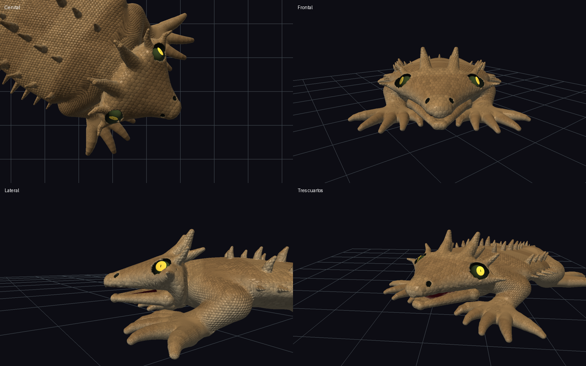
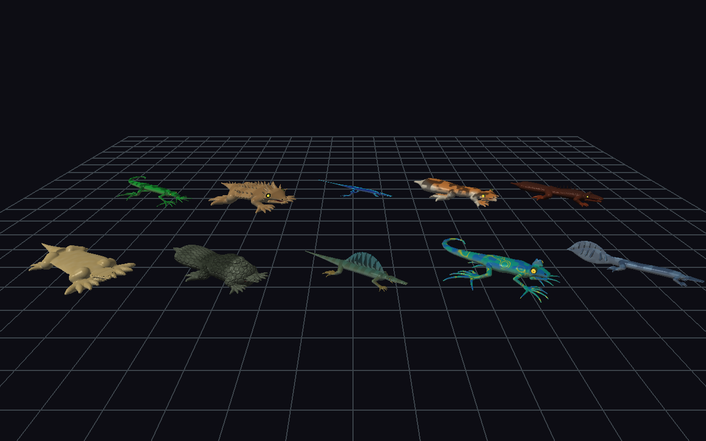
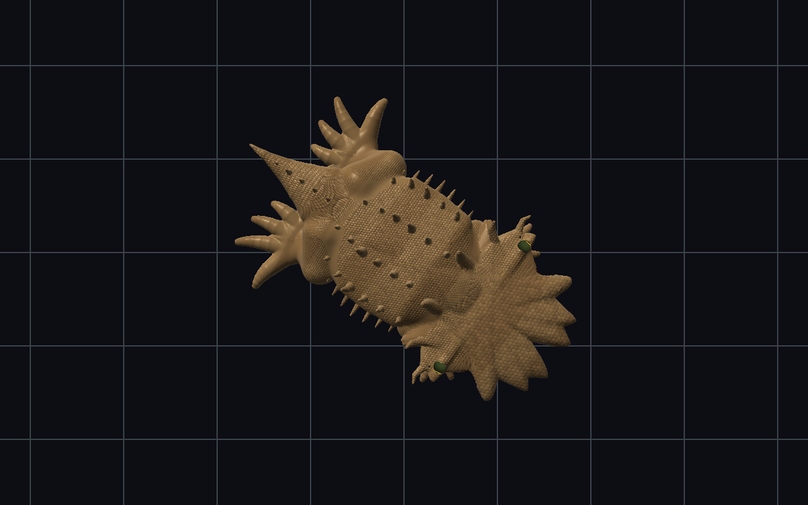

# Cabeza Desert Horned — semilla 55658

## Resultado

El cráneo conserva un volumen posterior ancho y profundo, con transición continua hacia un hocico corto y estrecho. Las órbitas quedan dentro del contorno lateral. La corona permanece en el perímetro posterior; sus soportes ya no añaden masas del tamaño del cráneo.



Referencia visual: `reference.png` en la raíz del proyecto. Se revisaron las vistas frontal, lateral, cenital y tres cuartos. La comparación es morfológica: la referencia usa otro acabado de escamas, ojos y materiales. La separación oral del render sigue siendo más visible que en la referencia.

## Dimensiones resueltas

Son semiejes, no diámetros. Los valores iniciales aproximados proceden del diagnóstico de la solicitud; la captura inicial se obtuvo antes de editar.

| Magnitud | Inicial aproximado | Final medido |
|---|---:|---:|
| Envolvente: escala de ancho | 1,57 | 1,1751 |
| Envolvente: escala de altura | 0,99 | 1,5546 |
| Radio craneal transversal | 2,07 | 1,1581 |
| Radio craneal vertical | 0,35 | 0,6182 |
| Radio craneal longitudinal | 0,66 | 0,6650 |
| Relación altura/ancho | 0,17 | 0,5338 |
| Radio facial raíz | 1,60 | 0,7133 |
| Radio facial medio | — | 0,4253 |
| Radio facial punta | — | 0,2679 |
| Órbita lateral X | 1,64 | 0,8081 |
| Órbita X / radio craneal | 79% | 69,78% |
| Masa de mejilla | 0,70 | 0,3550 |
| Fuerza mandibular | 0,73 | 0,4770 |

La altura craneal aumenta aproximadamente un 77%. La raíz facial mide el 61,6% del radio craneal; el estrechamiento continúa hasta la punta.

## Causas corregidas

- `HEAD_BROAD_TRIANGULAR` separa anchura posterior y profundidad vertical, reduce mejillas y define una cara estrecha. Desert Horned reduce `HEAD_LARGE`, elimina `HEAD_HEAVY_JAW` y usa ojos menores sin el rasgo de protrusión.
- `HEAD_CRANIAL_SHIELD` evita otro ensanchamiento fuerte. La cuña facial conserva espesor vertical, con raíz adelantada y ojos dorsolaterales integrados.
- El máximo de anchura del barrido SDF queda detrás del centro craneal. Los volúmenes de soporte temporal, maxilar y de mejilla permanecen integrados.
- Los soportes craneales de ornamentos antes reutilizaban el radio completo de la cabeza en un segmento orientado hacia cada cuerno. Un sondeo comparando el barrido con el campo compuesto confirmó que esos conectores volvían a ensanchar la cara. Ahora usan la sección de la raíz del ornamento y una unión local hacia el anfitrión.
- Los anclajes de la corona usan el radio longitudinal resuelto para su profundidad, en lugar del radio transversal.

No se modificaron los rasgos del cuerpo, las patas ni la cola. Los soportes de ornamentos no craneales mantienen su comportamiento.

## Verificación

- Reconstrucción forzada: `make -B -j4 test demos`.
- Regresión de cabeza triangular para semillas 55658, 17, 777 y 48201: volumen, estrechamiento por estaciones, posición orbital, contención ocular y mejillas.
- Los ocho anclajes craneales conservan secciones locales y solapan el cráneo resuelto.
- Suite existente de variaciones, anatomías aleatorias, SDF, mallas, animación y morfología.
- Render de los diez presets y revisión de vistas adicionales de Gecko, Sand Burrower, Stone Armored, Sailback y Jewel Chameleon.
- Los cambios SDF están en la compilación de estaciones y conectores, compartida por CPU y GPU; no se modificó el evaluador GLSL. Estas capturas usan la ruta de malla, no constituyen una prueba visual de la ruta de raymarching GPU.



## Reproducción

```sh
make demos/demo_lizard_diversity
./demos/demo_lizard_diversity --specimen=2 --seed=55658 --frames=1 --head-closeup --dump-anatomy --orbit=1.65993 --save-ppm=/tmp/desert-three-quarter.ppm
```

Para frontal: `--orbit=0.95993`. Para lateral: `--side --orbit=2.53073`. Para cenital: `--top`. El modelo del demo tiene un giro fijo de 55 grados, compensado por estos ángulos de cámara.

Registro de pruebas: `build/desert-head/final-check.log`. Capturas PPM y diagnósticos completos: `build/desert-head/after/`.


