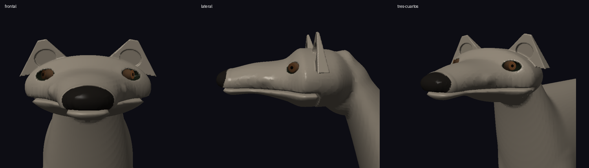
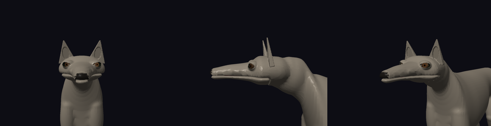
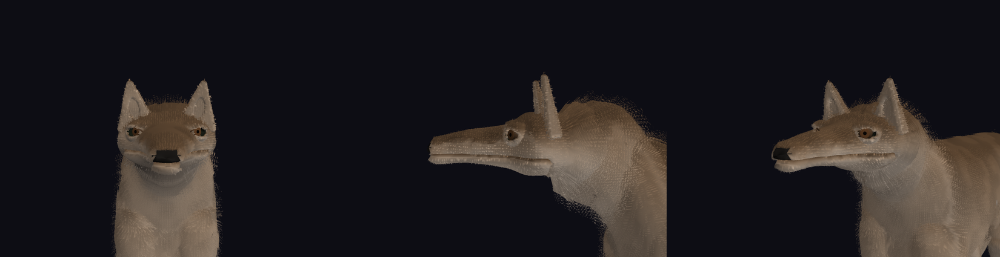

# Revisión de la cara canina

## Diagnóstico y cambios

- `Creature_ResolveAppearance` reemplazaba los centros oculares resueltos por el anclaje orbital más un desplazamiento negativo dependiente de cobertura palpebral. Ahora usa `leftEyeCenter/rightEyeCenter`; la apariencia ajusta como máximo un 5 % del semieje de profundidad. La cobertura se conserva en la abertura anatómica. El límite de tamaño ya no presupone la profundidad del globo reptiliano.
- `HeadPhenotype_CanidPreset` pedía explícitamente hocico corto/ancho, trufa grande, ojos pequeños y orejas bajas/gruesas. Ahora compone cráneo estrecho, hocico moderadamente más largo y convergente, menor masa temporal/maxilar y pinnae más altas y finas. Se conserva el barrido cónico compartido; no se añade geometría de una raza concreta.
- `HeadAnatomy_Resolve` orienta la mirada canina más hacia delante y coloca el reborde alrededor del globo, en vez de enterrarlo detrás. Reduce la profundidad visible del elipsoide ocular; reajusta la trufa para que siga emergiendo del premaxilar sin dominarlo. Inserción de cuello (`neckAttachment.y`) ajustada para alinear el occipucio con la cresta cervical dorsal.
- `MonsterSDF_Build` y `MonsterSDFMouth`: corrección del error estructural de collar degenerado (longitud 0.000 m). Implementación de puente cefalocervical de doble segmento elíptico orientado con estación intermedia (`Mid`) en nuca, anclaje postero-inferior en cráneo y conexión estanca directa en la primera estación axial C0.
- `AxialBodyUprightTetrapod_BuildSweepStations` (`AxialBodyUprightTetrapod.c` / `.h`): rediseño completo de la columna axial para tetrápodos erectos. Reemplaza el segmento único cuello-tórax (que producía un cuello cónico/cuña) por una secuencia de 9 estaciones de barrido axial continuas (`C0`, `C1`, `C2`, `W` [cruz escapular], `Post-W`, `Tórax Ant`, `Tórax Post`, `Abdomen`, `Pelvis`), garantizando orden $Z$ monótono decreciente, estrechamiento lateral en cuello medio (`C1`), ensanchamiento hacia la cintura escapular (`C2`), elevación de la cruz sobre los hombros y suave pendiente ventral hacia la quilla torácica.
- `AxialPhenotype` (`CreaturePhenotype.h`): adición de parámetros parametrizables `cervicalCurvature`, `cervicalDorsalMass`, `cervicalMidNarrowing` y `withersElevation`, calibrados en `InitDogRecipe` y normalizados por ontogenia.
- `InitDogRecipe` reduce la escala vertical de envolvente de 1,25 a 1,12 y armoniza el tamaño ocular con el preset. Se mantiene la escala corporal.
- `SurfacePreset_CanidShortDoubleCoat` reduce la longitud regional del pelo facial: el pelo no debe ocultar ojos ni engrosar visualmente las pinnae. No cambia la geometría ni el pelaje del tronco.
- `demo_dog --head-views` añade tres encuadres reproducibles y diagnóstico de dimensiones. `CephalocervicalTransitionChecks`, `CervicalArchitectureChecks` y `EyeAnchorChecks` comprueban la unión cefalocervical, la no protuberancia dorsal, la elevación de la cruz y el contrato anatómico en perro y lagarto, cuatro etapas ontogénicas.

## Geometría adulta resuelta

Dimensiones completas de cráneo: 1,083 × 0,678 × 1,430. Longitud de hocico desde la raíz: 0,712. Anchura de raíz/punta: 0,640 / 0,293. Pinna: anchura basal 0,398, altura 0,513, espesor basal 0,076. Collar cefalocervical: longitud total 0,370 m conectando estancamente en C0. Barrido axial de 9 estaciones con cresta de cruz elevada en $Z=0$ ($Y+H = 4.160\text{ m}$ vs dorso torácico $4.000\text{ m}$) y cintura cervical transversal en C1 (anchura $0.295\text{ m}$ vs C0 $0.336\text{ m}$ y cruz $0.625\text{ m}$). La malla de producción contiene 80 607 vértices y un único componente conectado.

## Verificación

`make test` y `make demos` terminaron con código 0: todas las suites pasaron, incluyendo las comprobaciones de continuidad C0, monotonía dorsal estricta (sin protuberancia/joroba), descenso ventral progresivo hacia el esternón y elevación escapular. Registro completo: `tests.log`.

## Capturas

Orden: frontal, lateral, tres cuartos. Las imágenes comparativas están recortadas para inspección; las capturas completas PNG y PPM se conservan en cada subdirectorio.

Antes:



Después, sin pelo:



Después, con pelo:



## Reproducción

```sh
make -B -j4 test demos
./demos/demo_dog --neutral --head-views --capture-dir=docs/validation/dog-face/sin-pelo
./demos/demo_dog --head-views --capture-dir=docs/validation/dog-face/con-pelo
./demos/demo_dog --neutral --sdf --head-views --capture-dir=docs/validation/dog-face/sdf
```

La comprobación GPU de la demo muestrea 796 puntos en orejas y perfiles musculares: error máximo 0,00000022. Es una comprobación localizada, no una prueba exhaustiva de toda la cabeza. La ruta SDF de diagnóstico no muestra los iris separados de la ruta de malla.

## Límites observados

La cabeza conserva una estética procedural estilizada. Hay faceteado visible en párpados, labios y límite de material nasal; el reborde orbital y la línea oral aún resultan simplificados en primer plano. El pelaje por conchas también presenta bandas visibles. Las capturas no acreditan realismo anatómico de calidad final ni validan visualmente todas las variantes futuras de cánidos. Se conservan los cambios preexistentes del proyecto.
