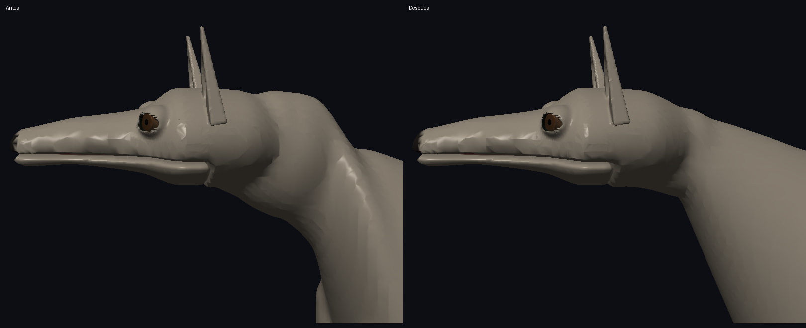
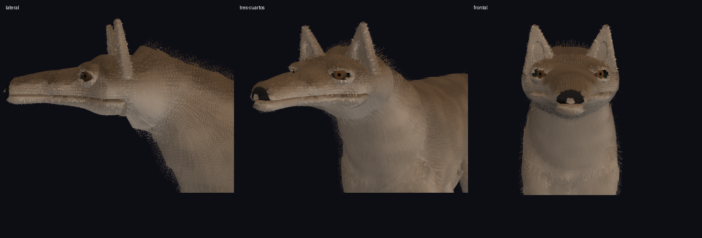

# Corrección del volumen cervical canino

## Causa

La sección superior del cuello era más alta que el cráneo (radio vertical 0,389 frente a 0,339), seguida de una reducción de anchura de 0,346 a 0,295. Después, la garganta caía de 3,546 a 2,939 en solo 0,209 de longitud sagital. La combinación producía una masa redondeada aislada con cintura posterior, visible sin pelo. El constructor del barrido también reconstruía centros y radios desde valores globales, ignorando los modificadores de las estaciones anatómicas.

## Solución

`AxialBodyUprightTetrapod_Resolve` resuelve una inserción nucal menor que el cráneo y mayor recorrido hacia delante: radio transversal 0,274, vertical 0,259 y recorrido sagital hasta los hombros 0,808. Se conserva el anclaje cabeza-cuello.

`AxialBodyUprightTetrapod_BuildSweepStations` deriva las estaciones de los nodos resueltos. Interpola por separado perfil dorsal, garganta y anchura desde nuca hasta hombros. Los controles de masa dorsal, curvatura y estrechamiento redistribuyen esa transición sin introducir una bola ni una cintura intermedia. La sección se ensancha de forma continua hacia el tórax. No se modifica la primitiva SDF, el shader, la cabeza ni la receta del pelaje.

La corrección pertenece al módulo axial del tetrápodo erecto; no depende del identificador del perro. El perfil reptiliano conserva su ruta propia.

## Inspección

Comparación con el mismo encuadre y sin pelo:



Lateral, tres cuartos y frontal con pelo:



Se conservan capturas completas en `before`, `sin-pelo`, `con-pelo`, `cuerpo` y `sdf`.

## Verificaciones

`make -B -j4 test demos` terminó con código 0 tras los últimos cambios: todas las suites pasaron, sin avisos de compilación. Registro completo: `tests.log`.

- Suite canina específica: pasada; incluye cuatro etapas, anclaje cefalocervical, conectividad y 60 secciones interpoladas por etapa para detectar máximos dorsales, retrocesos en la garganta y cinturas laterales.
- Regresión de propiedad anatómica: los modificadores del nodo cervical se conservan en el barrido.
- Malla adulta: 81 238 vértices, un único componente conectado.
- La demo incorpora 729 muestras adicionales en cuello y unión occipital: 1 525 muestras totales, error CPU/GPU máximo 0,00000054. Registro: `sdf/capture.log`.

## Reproducción

```sh
make -B -j4 test demos
./demos/demo_dog --neutral --head-views --capture-dir=docs/validation/dog-neck/sin-pelo
./demos/demo_dog --head-views --capture-dir=docs/validation/dog-neck/con-pelo
./demos/demo_dog --neutral --sdf --head-views --capture-dir=docs/validation/dog-neck/sdf
```

La inspección corresponde a una postura estática. El faceteado de la malla y las bandas del pelaje siguen visibles; esta corrección se centra en la forma del cuello.
