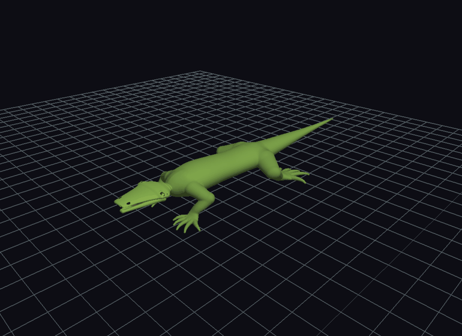
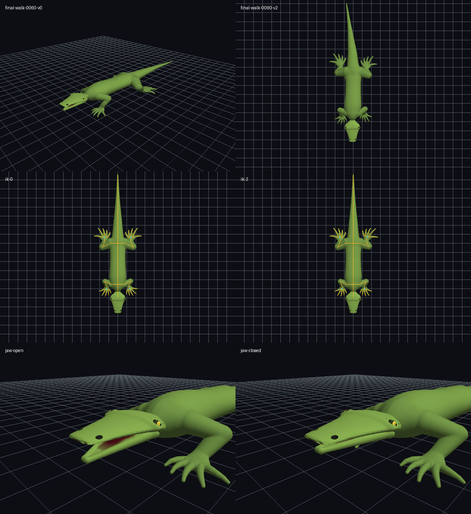
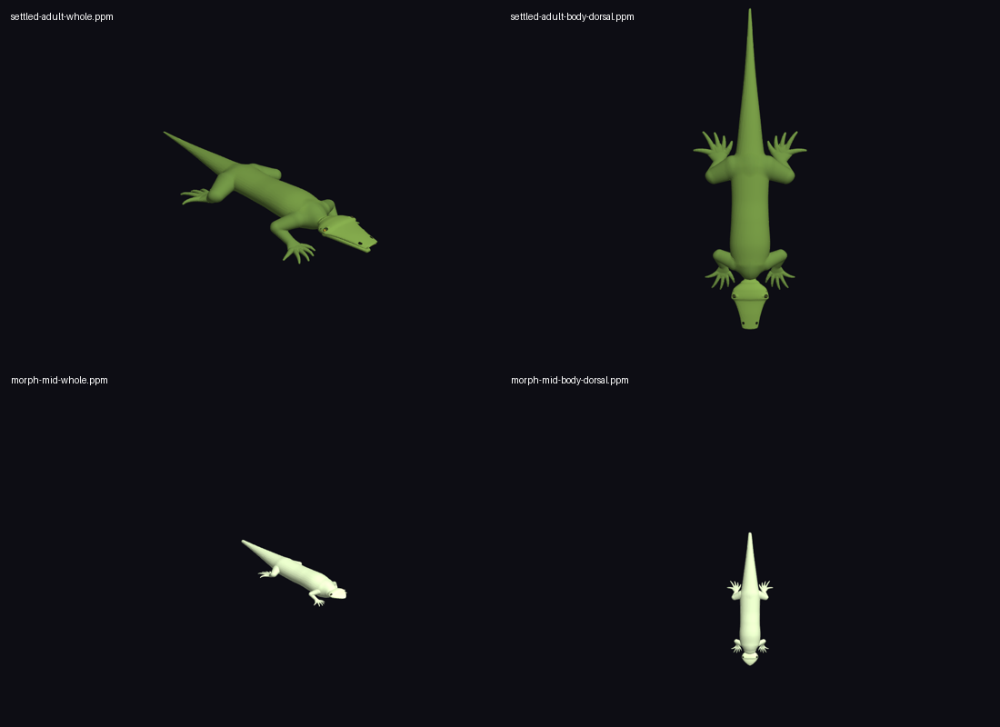

# Validación del primer hito esquelético

Ejecución local completada el 12 de septiembre de 2026. Base del trabajo:
`efdb93321d49613e4ac028a6d2b9f54e890a476d`. Cambios sin commit.

## Veredictos

| Comprobación | Resultado |
| --- | --- |
| Compilación normal forzada `make -B -j4 all test` | Todas las suites pasan; cero advertencias del compilador C. Doxygen conserva avisos de documentación. |
| ASan + UBSan + detección de fugas | Suite completa sin errores; presupuesto temporal desactivado solo en el build instrumentado. |
| Suite nueva instrumentada, incluida huella de índices | Exit 0, sin diagnósticos. |
| Pipeline visual juvenil → adulto instrumentado | Exit 0; sin errores ni fugas. |
| 480 objetivos 3D alcanzables de las cuatro patas | Convergencia dentro de 0,002 unidades. |
| Marcha visual, 180 frames | Error IK máximo 0,001999; error máximo de apoyo 0,001989; avance mundial 1,105 unidades. |
| Longitudes y topología | Longitudes constantes a precisión float; se conservan buffers, cantidades y contenido de índices. |
| Animación normal | Cero malloc/calloc/realloc, cero MonsterSDF_Build, cero entradas SDFMesher, cero invalidaciones de huella. |
| Cambio morfológico | Dos generaciones legítimas: juvenil inicial y adulto; fase conservada y bindings anteriores rechazados. |
| Ager asíncrono 0 → 1 → 0 | 405 mallas publicadas; 0 fallos; adulto con 20/20 extremos visibles. |
| Adulto SETTLED y edad intermedia MORPH | Capturas reales de 12 vistas por estado, incluidas manos/pies. |
| Ager GPU existente | Ejecutado 60 frames; ruta operativa, sin cambios en su arquitectura. |
| Demos IK, mandíbula y marcha | Ejecutadas y capturadas; las cuatro patas se probaron individualmente. |
| Demo de boca anterior y demo de consola | Finalizan correctamente. |

## Rendimiento CPU sin otras validaciones concurrentes

La malla adulta contiene **599.876 vértices** y **3.599.268 índices**.
Promedios sobre 180 frames con compilación `-O2`:

| Escenario | Pose/controladores/IK | Deformación visual | Total |
| --- | ---: | ---: | ---: |
| Adulto caminando | 1,068 ms | 19,370 ms | 20,438 ms |
| Juvenil → adulto | 1,004 ms | 16,585 ms | 17,589 ms |

El coste visual incluye cuerpo, ojos y articulación mandibular. Son tiempos CPU de
actualización, **no FPS de renderizado**. La malla adulta densa supera el presupuesto
de 16,7 ms para 60 Hz; permanece por debajo de 33,3 ms para actualización a 30 Hz.
La siguiente optimización recomendable es skinning GPU, sin reducir el detalle SDF.

La prueba morfológica heredada conservó su presupuesto release de 15 ms: entre
6,34 y 9,80 ms en el barrido final, con 20/20 dígitos en todas las edades.
No se usan tiempos ASan como estimación de rendimiento de producción.

## Evidencia visual

Capturas individuales: [oblicua](walk-oblique.png), [dorsal](walk-dorsal.png),
[rig IK](ik-debug.png), [boca abierta](jaw-open.png), [boca cerrada](jaw-closed.png)
y [demo bucal anterior](legacy-mouth.png).

## Registros

- [Build forzado y suite release](release-tests.log).
- [Suite ASan/UBSan](asan-tests.log), [suite nueva instrumentada](asan-focused.log), [pipeline visual instrumentado](asan-pipeline.log).
- [Benchmark adulto](performance.log), [cambio juvenil/adulto](morphology-animation-final.log).
- [Marcha visual](final-walk.log); sus tiempos incluyen carga concurrente y se usan para validar comportamiento, no para la tabla de rendimiento.
- IK [pata 0](ik-0.log), [pata 1](ik-1.log), [pata 2](ik-2.log), [pata 3](ik-3.log).
- Mandíbula [abierta](jaw-open.log), [cerrada](jaw-closed.log), [demo anterior](legacy-mouth.log).
- [Ciclo asíncrono completo](ager.log), [adulto SETTLED](settled-adult.log), [MORPH intermedio](morph-mid.log), [ager GPU](gpu-ager.log), [consola](adult-console.log).

## Inventario de implementación

Cabeceras e implementaciones nuevas en `include/` y `src/`:
Quaternion, Skeleton, RigBuilder, IK, LizardRig, AnatomyDeformer, Locomotion,
LizardGaits, ProceduralAnimator, MonsterAnimation y AnimatedVisual.
También se añade `src/WorldInterface.c`.

Entradas nuevas: `demos/demo_lizard_animation.c` (modos IK, mandíbula y marcha),
`benchmarks/benchmark_animation.c` y `tests/test_animation.c`.
La explicación arquitectónica está en [PROCEDURAL_ANIMATION.md](../../PROCEDURAL_ANIMATION.md).

Archivos existentes modificados: Makefile y .gitignore; Monster.h/c y Lizard.c para
propiedad/configuración; LizardMorph.h/c como puente; MonsterVisual.h/c para validar
generaciones y proteger copias de mallas vacías; MonsterVisualAsync.h para tipos
oculares/deformador; WorldInterface.h para superficie; OpenGLRenderer.h/c para
plataforma y líneas debug; tests/main_test.c y tests/test_morph.c para registro y
separación del presupuesto temporal en builds instrumentados.

## Alcance confirmado y límites

Normalizar una pose no reconstruye SDF ni Marching Cubes y no modifica AnatomyGraph.
El solver es genérico y los límites/gait de lagarto están en sus perfiles. Los pies
usan contactos mundiales; mandíbula, cuello/cabeza, columna y cola siguen controles FK.

La integración de skinning usa MonsterVisual; el ager GPU y la publicación asíncrona
siguen sus rutas existentes. No se afirma que el ager GPU anime esqueletos. Las
limitaciones de skinning lineal, giro, obstáculos, contactos digitales y transición
entre mallas morfológicas se detallan en el documento de arquitectura.
