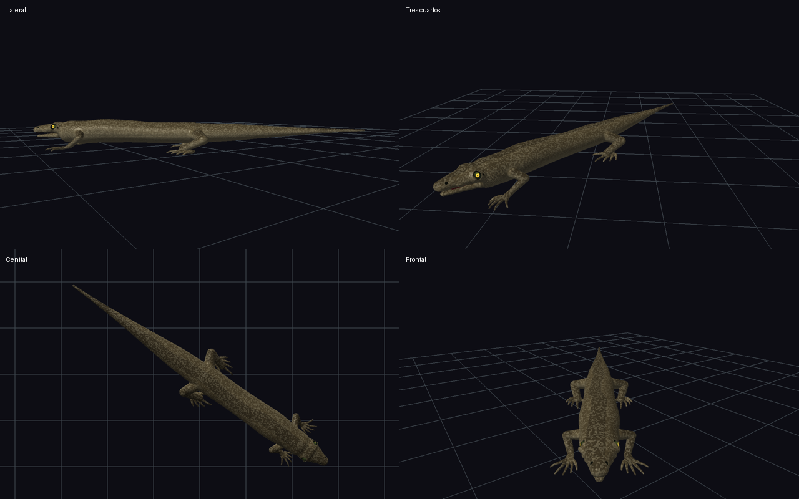
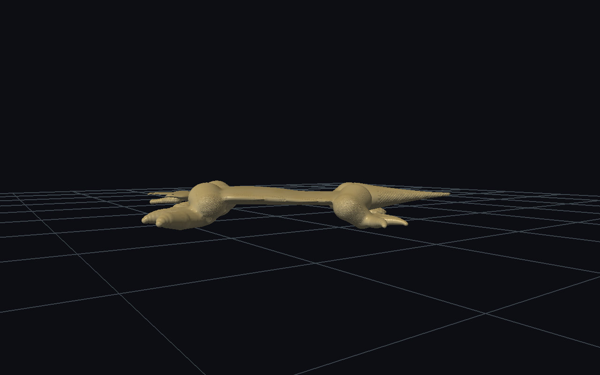

# Sand Burrower: silueta de referencia

Referencia proporcionada por el usuario: [fotografía](reference.png). La comparación se centra en un tronco alargado de sección ovalada, cabeza compacta con volumen, cuatro miembros gráciles, dedos finos y cola larga afinada. La pose de reposo mantiene la cola extendida; no reproduce la curvatura postural de la fotografía.



## Cambios

- La receta deja de combinar cuerpo plano y robusto, cabeza de pala, miembros excavadores y cola corta. Compone elongación moderada, sección ovalada, miembros gráciles y cola ahusada larga.
- Nuevo rasgo reutilizable `CREATURE_TRAIT_HEAD_STREAMLINED`: proporciones craneales y faciales, espesor rostral, mandíbula compacta y disposición ocular. No depende del nombre de la variante.
- Nuevo rasgo `CREATURE_TRAIT_NECK_CONTINUOUS`: la anchura cervical sigue la cintura anterior (96% en esta receta), conservando el grosor entre cráneo y tronco. Se elimina de la normalización el límite universal que forzaba cuellos adultos al 80% de los hombros.
- Nuevo rasgo `CREATURE_TRAIT_FEET_NARROW`: autopodios estrechos, cinco dedos finos y extensión digital moderada. Admite selección de miembros anteriores o posteriores.
- Corrección del soporte maxilar de cabezas reptilianas barridas: queda por encima de la línea oral. Antes, el recorte de la boca separaba dos pequeñas islas de tejido. Se corrigió la anatomía; no se eliminaron componentes de la malla.
- Nuevo rasgo `CREATURE_TRAIT_LIMBS_RETRACTED`, aplicado solo a los miembros posteriores: rodillas hacia atrás, tobillos hacia delante y autopodios girados 155 grados hacia delante/fuera. `proximalSweep`, `distalSweep` y `footYaw` son controles fenotípicos interpolables; la rotación del pie conserva las longitudes digitales y la simetría izquierda/derecha. Los valores neutros mantienen los demás presets.
- Paleta parda con moteado fino, pupila redonda y escamas pequeñas.
- El demo admite `--zoom=` para inspeccionar la criatura completa con mayor detalle.

## Medidas: semilla 61006

| Magnitud | Resultado |
|---|---:|
| Longitud / anchura del tronco | 4,038 |
| Altura / anchura torácica | 0,759 |
| Longitud de cola / tronco | 1,354 |
| Radios craneales transversal / vertical / longitudinal | 0,6309 / 0,4319 / 0,7745 |
| Altura / anchura craneal | 0,6846 |
| Radios faciales raíz / medio / punta | 0,5096 / 0,3361 / 0,2434 |
| Componentes de la malla corporal | 1 |
| Triángulos de la componente corporal | 253554 |
| Radio cervical / craneal / escapular | 0,6307 / 0,6309 / 0,6570 |
| Radio vertical cervical / escapular | 0,5338 / 0,5494 |

Los ojos y la mandíbula son piezas articuladas separadas, como en el resto del motor.

## Verificación

Pruebas de regresión con semillas 61006, 888 y 17: proporciones resueltas, continuidad cervical con cráneo y hombros, cinco dedos por miembro, radios de autopodios, orientación posterior de rodillas y anterior/exterior de dedos, interpolación del giro del pie, malla de producción conectada, cerrada y manifold. Se usa voxel 0,11, presupuesto 350000 celdas y resolución máxima 256, igual que en el demo.

Se ejecuta `make -B -j4 test demos` después de la última edición. Registro: `build/sand-burrower/final-check.log`. También se revisan cuatro vistas de la semilla 61006 y la cuadrícula de los diez presets. Las imágenes proceden del render de malla OpenGL.

```sh
make demos/demo_lizard_diversity
./demos/demo_lizard_diversity --specimen=6 --seed=61006 --frames=1 --zoom=1.65 --orbit=1.65993 --dump-anatomy --save-ppm=/tmp/sand-burrower.ppm
```

Vista lateral: `--side --orbit=2.53073`; cenital: `--top`; frontal: `--orbit=0.95993`.

## Estado anterior



## Orientación posterior (semilla 61006)

El eje +Z apunta hacia la cabeza. La cadera izquierda está en Z=-7,320; la rodilla en -7,727; el tobillo en -6,758 y el autopodio en -7,120. La rodilla queda detrás de la cadera y el pie vuelve hacia delante. El miembro derecho es su reflejo lateral; las extremidades anteriores conservan su postura.
